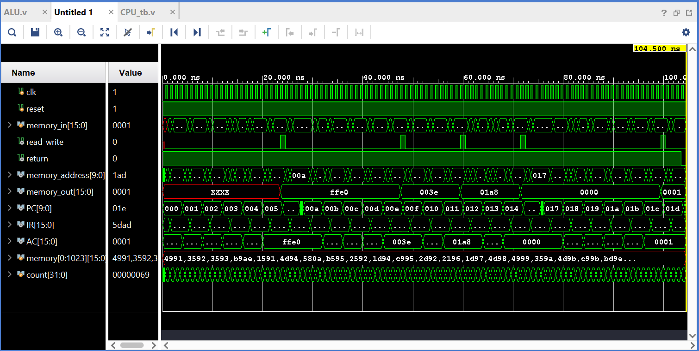

# 16 bit Accumulator based CPU with 1KB memory
This is a verilog-coded 16 bit CPU which is based on Von Neumann Architecture.

## What it is capable of?
This CPU is capable of executing a series of predefined instructions on the Data, all being provided in the memory. The following actions can be performed on the data-
- 00000 Set output to decimal value 0
- 00001 Set output to decimal value 1
- 00010 Set output to decimal value -1
- 00011 Set output to input x
- 00100 Set output to input y
- 00101 Set output to not of input x
- 00110 Set output to not of input y
- 00111 Set output to negative of input x
- 01000 Set output to negative of input y
- 01001 Set output to increment of input x by 1
- 01010 Set output to increment of input y by 1
- 01011 Set output to decrement of input x by 1
- 01100 Set output to decrement of input y by 1
- 01101 Perform addition on the two inputs
- 01110 Perform subtraction: x-y
- 01111 Perform subtraction: y-x
- 10000 Perform bitwise ‘and’ between the two inputs
- 10001 Perform bitwise ‘or’ between the two inputs
- 10010 Read from memory store in the accumulator
- 10011 Write the output to memory
- 101000 Jump to given instruction address
- 10101 Jump to the given instruction address if the last output was zero
- 10110 Jump to the given instruction address if the last output was negative
- 10111 End the program

## Screenshot of the Output 

